Universidad de Costa Rica   
CI-0148 Aprendizaje Máquina  
Período: 2022-I  
Docente: Pablo Sauma Chacón  
Estudiantes: 

- Jose Pablo Mora Villalobos. B85326 
- Juan José Valverde Campos. B47200 
***

# Proyecto

Objetivo: Demostrar el dominio de los temas aprendidos como parte del curso de Aprendizaje Mecánico.

[Descripción del proyecto](https://docs.google.com/document/d/1JFvNqhy017XqFZlVCkcbvSPha_hM0DArC_xYcJBSkLI/edit)

# Introducción 

Nuestro proyecto consiste en implementar un agente inteligente capaz de desempeñarse correctamente en el juego de 1978 llamado Breakout , el cual tuvo lanzamiento en la consola de Atari 2600. 

Nuestra implementación del juego tiene la siguiente interfaz.

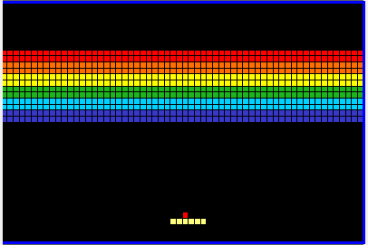

# Juego a Implementar

## Descripción del juego

El juego breakout consiste en romper todos los bloques con el cuadro rojo, para esto se cuenta con una paleta que dirige la bola hacia dichos bloques, en donde el juego termina cuando se han quebrado todos los bloques o bien la bola toca la parte de abajo en la pantalla, en el primer caso el jugador es victorioso y en caso contrario el jugador pierde. Este juego es de tipo IA vs entorno.

## Figuras implementadas

**Bola**

Como figuras a implementar se tiene primeramente un cuadrado de color rojo que simboliza una bola.

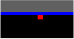

**Paleta**

Otra figura consiste en una paleta con 6 cuadrados de color amarillo que es la figura que dirige el jugador.

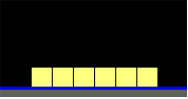

**Bloque**

Finalmente la última figura a implementar consiste en un bloque que tiene 8 cuadrados de distintos colores , donde los mismos se agrupan en filas de 4 en 4.

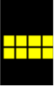

## Lógica de espejo

Una parte esencial del videojuego implementado consiste en la interacción entre las figuras creadas y la bola, para esto se tendrá un efecto de espejo donde simplemente se hace un rebote (salvo la paleta) como se muestra a continuación.

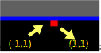

## Lógica de bola

Por otra parte, el movimiento de la bola consiste en 4 movimientos que determinaran como la misma interactúa con su entorno.

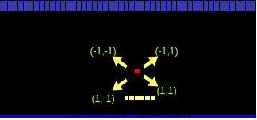

## Lógica de bloques

Los bloques son la única figura que desaparecen cuando la bola tiene una interacción con ellos, aquí se elimina el bloque completo (es decir los 8 cuadrados implementados).

Los bloques como se ha mencionado tienen un efecto con la bola de tipo espejo, no obstante cuando existe un contacto a nivel de vertices como se muestra a continuación se asume que existe un bloque arriba o abajo de la bola (según su dirección) y se realiza un movimiento de espejo. Tomando en consideración lo anterior dicho bloque también desaparece. 

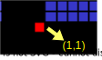

## Lógica de pared

La pared es importante pues permite que la bola no salga de la pantalla para esto la misma obedece un movimiento de espejo.

## Lógica de paleta

Como se ha mencionado la paleta es la única que no obedece una lógica de espejo a la hora de rebotar la bola, para esto se ha implementado como el juego de ATARI, para ser lo más fiel al mismo, donde la mitad de los rebotes van hacia una dirección y la otra mitad dirigen la bola en otra dirección.

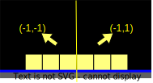

## Movimientos de paleta

Debido a circunstancias visuales se ha implementado un movimiento de la paleta que se realiza de dos en dos, cuando se va a la izquierda o derecha en búsqueda de que la bola no toque la parte de abajo de la pantalla.

Es importante recalcar que un jugador y en el caso particular implementado existe únicamente 3 movimientos, siendo estos derecha, izquierda o mantenerse en la posición si no se elige ninguna otra.

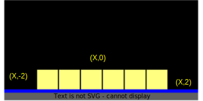

## Combinación de lógicas

A pesar de los movimientos expresados ocurren situaciones particulares de implementación que tuvieron que atenderse de la siguiente forma.

Cuando una bola contacta a su vez con la paleta y una pared se realizará el siguiente movimiento. 

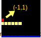

Cuando una bola contacta como su muestra a continuación se realiza el movimiento que se presenta, donde se termina quebrando únicamente los bloques de arriba y abajo y la lógica de diagonal no ocurre y por lo tanto ese bloque respectivo no se rompe.

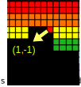

# Algoritmo de aprendizaje Mecánico

El algoritmo de aprendizaje mecánico que se eligió para aprender a jugar este juego es `Deep Q Learning`. Este es un modelo de aprendizaje por refuerzo, lo que significa que para aprender recibe recompensas mientras juega, dependiendo de las acciones que realiza en un estado determinado. `Deep Q Learning` es similar a la técnica de `Q-Learning`, que utiliza una función Q para definir la mejor acción que debe realizar un agente. En este caso, se simula la función Q con una tabla compuesta por los estados y las recompensas que se obtiene al ejecutar alguna acción. Para `Deep Q-Learning` la función se simula con una red neuronal que recibe un estado y da un valor para cada acción posible. Se considera que la mejor acción está dada por el valor más alto en la salida de la red. Para entrenar la red, el agente va a jugar multiples partidas y almacenar Los valores de estado actual, acción, estado resultante y recompensa en un memoria llamada `replay memory`. La red utiliza bloques aleatorios de la memoria para evitar introducir sesgos en el entrenamiento generados por entrenarse con estados consecutivos.

Para el juego en cuestión, Breakout, este algoritmo funciona bien debido a que se pueden generar estados a partir del entorno de juego y las acciones son muy limitados, por lo que la red no debe tardar mucho en entrenarse y poder intentar resolver el juego.

## Recompensas 
Las recompensas pueden ser buenas, si se quiere premiar la acción elegida, o malas en caso de que se quiera castigar, por ejemplo, si pierde el juego. En Breakout, decidimos dar una recompensa de 100 si el agente logra posicionarse debajo de la posición de la bola, 1000 si por cada bloque que destruya en el un solo estado o movimiento (puede ser hasta dos), -10 si no sucede nada (no se rompe ningún bloque y la paleta no está debajo de la bola) y -1000 si pierde es juego. 

# Características del Agente 

El agente implementado tiene su base en el manejo del paddle (paleta) que se mueve alrededor de nuestro videojuego.

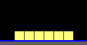

La forma en como este interactúa se expone a continuación:

## Entradas 

Como entradas nuestro agente tiene principalmente un sensor por cada uno de sus cuadros (6 en total) que puede percibir si en la misma columna de uno de sus cuadros se encuentra una bola. En caso de esto ocurrir se pone un valor 1, en caso contrario se pone un valor -1.

A modo de ejemplo se adjunta la siguiente imagen que tendría como entrada para el agente en ese momento un valor de input igual a:
    
    [-1, -1, -1,  1, -1, -1]

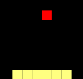

**Nota:** En caso de que un bloque exista en el medio de la paleta y el cuadro rojo de igual forma la paleta puede detectar al cuadro rojo.

## Salidas 

A nivel de salidas se recibe tres valores, los cuales indican el posible valor que obtendría el agente en caso de tomar cada una de sus decisiones posibles, siendo estas (Derecha, Izquierda, Mantenerse).

El agente bajo los valores que se obtenga elegiría al que sea mayor entre todos y con esto realiza su movimiento final.

## Interacción con el espacio

El agente, tiene una interacción muy bajo con el entorno, debido a que este interactúa mayoritariamente realizando un seguimiento hacia una bola, similar al juego del pong.

Realmente si se observa para dicho agente el hecho de quebrar bloques no tiene una mayor implicación, más que los mismos al igual que paredes puedan cambiar la trayectoria de la bola.

## Desafíos encontrados

Como principales desafíos que encontramos se encuentran los siguientes:

### 1. La lógica del entorno

Debido a las condiciones del entorno donde se construyó el juego y para simplificar el flujo del mismo, la lógica y físicas del juego se programaron un poco distintas al Breakout original. 

Con respecto a la bola, se tiene que siempre se mueve a 45° en alguna dirección, o sea, un movimiento diagonal. Esto tiene solo algunas implicaciones en el juego, por ejemplo, que la trayectoria de la bola después de rebotar con algún objeto es bastante predecible. Además, la bola siempre tiene una velocidad constante. Esto implica que la bola se mueve un solo espacio en cada estado del ambiente.

Por otro lado, para incluir un poco de fluidez en el juego se decidió que la paleta se movería dos espacios a la vez en cualquier dirección. Esto es porque en las primeras versiones del juego, seguir a la bola se volvía muy difícil debido a que tanto la bola como la paleta se movían a la misma velocidad (un espacio), por lo que al aumentar la velocidad de la paleta fue más sencillo y más consistente seguir la bola. 

### 2. Entrenamiento de agente 

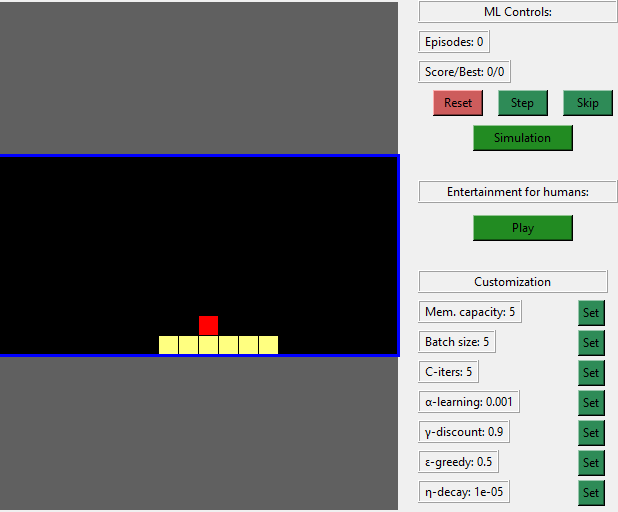

Para realizar el entrenamiento de nuestro agente se utilizó el siguiente escenario, el mismo elimina por completo los bloques y únicamente utiliza la paleta y el cuadro de color rojo, donde lo que se busca es enseñarle a nuestro agente que la bola nunca debe de tocar la parte de abajo del cuadro azul (suelo).

Este aspecto como se verá más adelante permitió que nuestro agente pudiera no perder nunca en el juego, no obstante como se puede ver no es adaptable al 100% al objetivo del juego de conseguir romper todos los bloques (aspecto que se explicará en los resultados obtenidos).

Como datos de entrenamiento se utilizó los hiperparámetros que se adjuntan en la imagen respectiva, donde para obtener los resultados deseados debe de entrenarse por un total de **100** simulaciones.

Por otra parte y a efectos del mecanismo de Q-learning se tienen los siguientes premios:

* No seguir el cuadro rojo = -100

* Seguir el cuadro rojo = 100

* Destruir un bloque = 1000 **(Ver Nota)**

* Contacto con suelo = -1000

**Nota:** Como se observa existe puntos por destrucción de bloques, esto es por que intentamos escalar posteriormente a nuestro agente (con el escenario real), pero no obtuvimos los mejores resultados y más bien con pocas simulaciones nuestro agente dejaba de seguir la bola y perdía. 

## Resultados Obtenidos

Primeramente, podemos mencionar que hemos obtenido un agente que es capaz de jugar el juego que teníamos pensado, como se puede observar en la siguiente imagen.

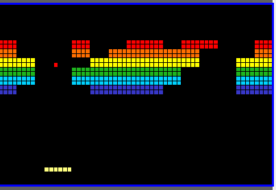

No obstante, como aspecto a considerar, hemos detectado el hecho de que el agente implementado no puede obtener el final del juego, debido a que el mismo tiene un comportamiento determinista, dado que como se mencionó el mismo solo sigue a una cuadro color rojo. 

Lo que ocurre provoca un agente que nunca pierde pero que tampoco logra romper todos los bloques, donde a continuación se muestra el escenario donde se ha podido destruir la mayor cantidad de bloques en el caso predeterminado del laboratorio, antes de que nuestro agente quede ciclado.

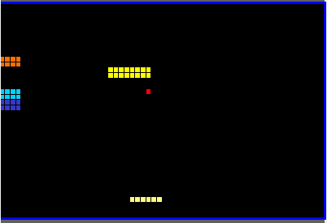

## Futuras Implementaciones

Debido a cuestiones de tiempo no pudimos realizar mucha adaptabilidad a nuestro agente para comportarse en el escenario deseado.

No obstante, consideramos que las siguientes entradas son adaptables a las soluciones que ya tenemos (el entrenamiento más pequeño y su posterior escalabilidad) y podrían mejorar el rendimiento de nuestro agente.

1. Poner la posición actual del cuadro rojo, permitiría ya no tener que seguir siempre al cuadro rojo y posicionarse bien para golpear el cuadro rojo para romper bloques.

2. Poner la dirección del cuadro rojo, para poder posicionarse con el punto anterior y golpear bien el cuadro rojo. 

3. Un vector con los bloques y si están destruidos (valor 1) o no (valor -1), para que el agente sepa como posicionarse para romper un bloque en específico. **(Ver Nota)**

**Nota:** En el caso pequeño lo que podría ingresarse es un vector con puros valores en 1, y así la red neuronal tendría al menos la noción de seguir la bola y posteriormente adaptarla.

# Aspectos Generales de reproducción de código

El código de esta entrega utiliza por defecto un modelo que ya ha sido entrenado como se explica en la sección de entrenamiento del modelo. Sin embargo es posible crear un agente desde cero para cambiar los parámetro de entrenamiento desde la interfaz para tener los valores deseados. Para hacer esto, primero se debe cambiar la variable global `LOADMODE` del archivo  ML.py, la cual se encuentra en la línea 5. Si se utiliza `True` se carga automáticamente un archivo llamado modelo_ultimo con el los pesos de la red y otras configuraciones. Si se utiliza `False`, se va a crear un modelo completamente nuevo tanto para las redes *target* y *policy* de la red.

Otro aspecto importante es que si se quiere generar un modelo como el de la sección de entrenamiento, primero se debe crear un ambiente con dimensiones más pequeñas y quitar los bloques. Para esto se deben cambiar las variables `HEIGHT`, `WIDTH`, `INIT_DIRECTION` y `DISABLE_BLOCKS` del archivo breakout.py. Estas variables se encuentran en las líneas 27, 28, 32 y 24 respectivamente. Los valores que deben tener para crear el modelo que generamos en el archivo modelo_ultimo son 10, 20, (8, 10) y `True`. Esto va a hacer que el ambiente no tenga bloques, y que las dimensiones del ambiente sean de solo 10 cuadros de altura y 20 de anchura. Los parámetros de entrenamiento son los mismos que se muestran en la interfaz la primera vez que se corre el programa.

Para crear un modelo que se entrene desde cero y con las dimensiones originales del juego y los bloques en el ambiente. Para esto solo es necesario dejar los valores que traen las variables por defecto en código, y utilizar la variable `LOADMODE` del archivo ML.py con el valor `False` como se explicó anteriormente.

Por lo demás, para ver la demostración del modelo que entrenado que decidimos entregar no se debe modificar ninguna de las variables que se explican aquí y solo se tiene que oprimir el botón `Simulación` de la interfaz.
